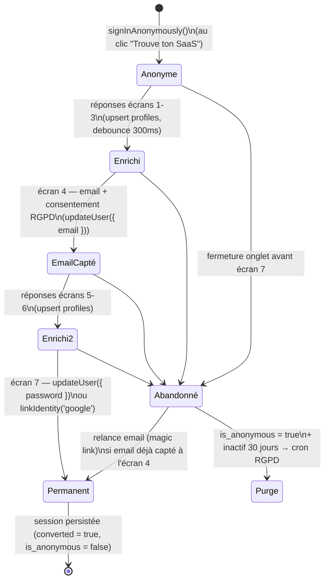

# Auth invisible — cycle de vie de l'identité

## 1. Diagramme du cycle de vie

Chaque flèche correspond à une écriture DB réelle, jamais à un état purement local :
`profiles.id` est stable de bout en bout — c'est le **même** UUID depuis
`signInAnonymously()` jusqu'à la conversion, donc aucune migration de données
n'est nécessaire à l'écran 7 : on ne fait que changer les credentials attachés
au compte qui existe déjà.

## 2. Pièges "auth générique" à éviter

| Piège | Pourquoi c'est un piège | Correction appliquée |
|---|---|---|
| "Créer un compte" comme étape nommée | Reconnu instantanément comme un mur, même stylé | Écran 7 dit "Sécurise ton accès", jamais "inscription" |
| Confirmation de mot de passe redondante | Frictionne pour un bénéfice marginal (un simple "afficher" fait le même travail) | Un seul champ + toggle œil, pas de second champ |
| "Paiement 100% sécurisé" sans preuve | Rassurance verbale non étayée = zéro crédibilité, lu comme du bruit | Bannie ; toute mention de sécurité doit pointer un fait vérifiable (ex. "chiffré via Supabase/Postgres RLS", jamais un badge générique) |
| Formulaire qui ignore l'état déjà rempli | Redemander prénom/email déjà donnés casse l'illusion de continuité et sent le formulaire mal branché | Écran 7 pré-remplit l'email (lecture seule + "Modifier" discret), ne redemande jamais le prénom |
| Redemander des infos déjà données | Perçu comme un bug, pas comme de la prudence | Toute donnée déjà en `profiles` est lue depuis le contexte, jamais re-saisie |
| Toast "Enregistré ✓" à chaque réponse | Casse l'immersion du quiz, donne l'impression qu'on vient de faire une action "compte" | Sync silencieuse, aucune UI de sauvegarde visible |
| OAuth qui ouvre un flow séparé | `signInWithOAuth` classique perdrait la session anonyme et ses réponses | `linkIdentity('google')` explicitement, qui lie l'identité à la session anonyme existante au lieu d'en créer une nouvelle |
| Bloquer sec sur "email déjà utilisé" | Message d'erreur pur = dead end, l'utilisateur perd tout son travail de quiz sans recours | Écran de transition honnête proposant la connexion au compte existant (voir §3) |

## 3. Plan de repli — abandon avant l'écran 7

Nécessite qu'un email ait été capté **avant** l'abandon : c'est tout le rôle de
l'écran 4 (email capturé dès le milieu du funnel, bien avant l'écran de mot de
passe). Sans cet email précoce, un abandon anonyme est définitivement perdu
(aucun canal de relance) — d'où l'insistance du brief à capter l'email tôt et
séparément du mot de passe.

Séquence de relance :
1. `profiles.funnel_last_step` est mis à jour à chaque écran (déjà inclus dans
   le patch debounced) — il indique jusqu'où l'utilisateur est allé.
2. Un job planifié (Supabase Edge Function + `pg_cron`, hors scope de ce
   livrable mais préparé par le schéma) sélectionne les profils où
   `email is not null and converted = false and updated_at < now() - interval '2 hours'`.
3. Email de relance : "Ton résultat est prêt — {match_count} SaaS
   correspondent à ton profil, sécurise-le en 10 secondes" avec un
   **magic link** (`supabase.auth.signInWithOtp({ email })`) qui restaure la
   session anonyme existante (Supabase relie l'OTP à l'utilisateur déjà
   propriétaire de cet email) et dépose directement l'utilisateur sur
   l'écran 7 — jamais besoin de repasser tout le quiz.
4. Si l'utilisateur ne revient jamais et reste `is_anonymous = true` : purge
   RGPD automatique après 30 jours d'inactivité (voir schéma SQL, section
   rétention).
